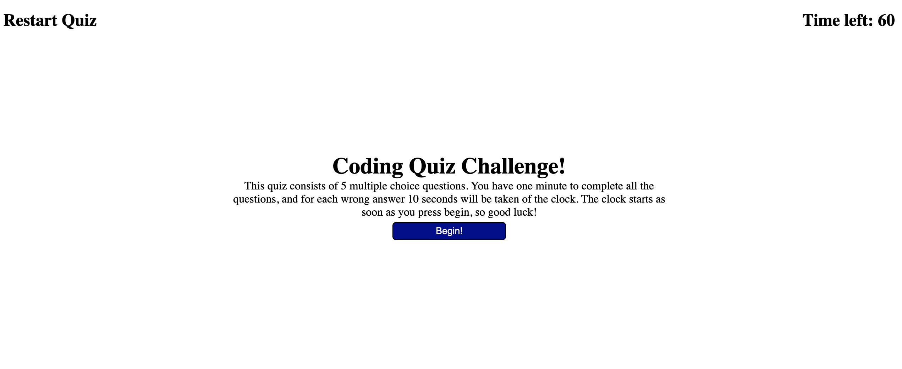

# javascript-quiz
A timed quiz with multiple question answers about javascript

## Description
- What was your motivation?
My motivation was to create a javascript quiz to practice creating dynamic web apps
- Why did you build this project?
I built this project to be able to create dynamic web apps that users can interact with.
- What problem does it solve?
It allows users to test their javascript knowledge
- What did you learn?
I learned how to better utilize the DOM to make web apps more dynamic and user friendly

## Installation

I wrote the code from scratch and then used GitHub Pages to deploy the application to the web.

## Usage

Click the 'Begin' button to start the quiz, and then simply click on which answer you believe
is correct when a question is presented.  After the quiz is over it will show your final score.

## License

MIT License

## Link to deployed application

